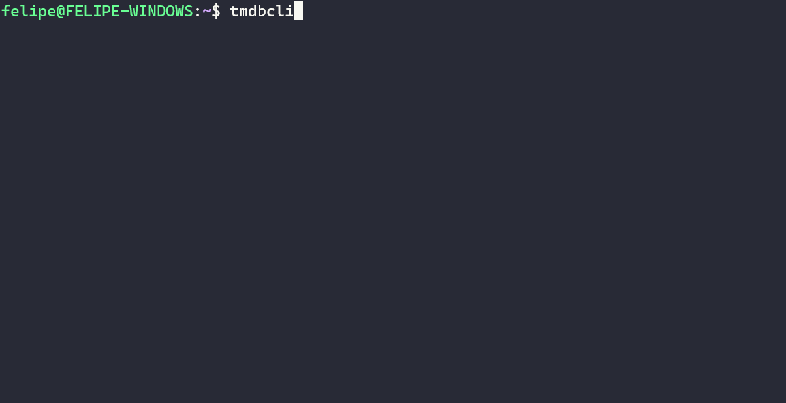

# tmdbcli 💻

A CLI created to get infos about movies and series in TMDB database. 

With 'tmdbcli' you can get infos about: 
- Top rated movies
- Top popular movies
- And more.

This project **IS NOT** created by [TMDB (The Movie Database)](https://www.themoviedb.org/) team. This project was created just to people that really like movies, series and love CLI too. Ensure your use case does not violate their API terms of service.



## Requirements 🛠️

- TMDB's API Key 
    - Documentation that have information about API Key creation: https://developer.themoviedb.org/docs/getting-started
- `TMDB_CLI_BEARER_TOKEN` environment variable with the value of **API Read Access Token (not the API Key)**
    - This environment variable can be loaded from an `.env`, `.bashrc`, `.zshrc` files or any another way that you want and feel confortable.

## Install ✅

### Have Go in your OS?

Use the `go install` command.

For example, if you want to install the latest version: `go install github.com/fschossler/tmdbcli@latest`

### Don't have Go in your OS?

**Download and install the latest version:**

```bash
sh -c "$(curl -sSL https://raw.githubusercontent.com/fschossler/tmdbcli/main/scripts/download-and-install.sh)"
```

### Releases Page

- Go to the [Releases page](https://github.com/fschossler/tmdbcli/releases), download and extract the file based on your OS. Remember to put the `tmdbcli` in a folder that stay inside the environment variable $PATH.

## Versions 🏷️

**All the available versions are in the** [Releases](https://github.com/fschossler/tmdbcli/releases) page.

## Usage 👩‍💻

Use "`tmdbcli` [command] --help" for more information about a specific command or subcommand.

**Example:** `tmdbcli movie --help` (Shows the two available subcommands: `toprated` and `toppopular`)

## Contribute 💪

Feel free to fork this project and open a PR. I'm gonna appreciate that.

If you're using VSCode a tip for debug is create the `launch.json` file inside the `.vscode` folder for testing commands and subcommands. For example.

```json
{
    "version": "0.2.0",
    "configurations": [
        {
            "name": "Launch Go Program",
            "type": "go",
            "request": "launch",
            "mode": "auto",
            "program": "main.go",
            "args": ["movie", "toprated"],
            "env": {
                "TMDB_CLI_BEARER_TOKEN": "Your Read Access Token"
            }
        }
    ]
}
```

## LICENSE 📖

This project is under MIT license. You can check the LICENSE [here](https://github.com/fschossler/tmdbcli/blob/main/LICENSE)
